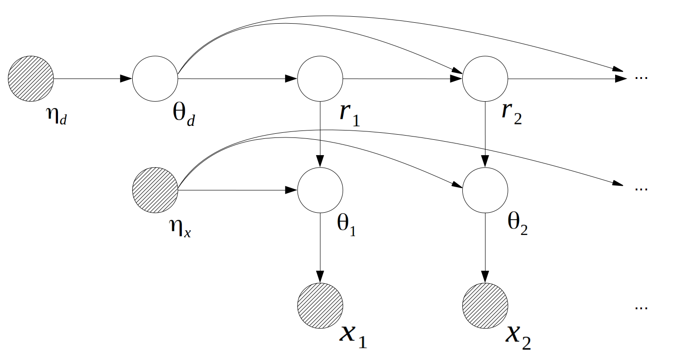

# Bayesian online change point detection and offline learning

This repository provides a modern explanation and extension to the Bayesian change point model proposed by Adam and MacKay[^1].  The algorithms are implemented with R and C++, mathematical definitions and proves are provided in this README file.

## Table of contents

+ [Introduction](#introduction)
  + [The Model](#the-model)
  + [The Inference Problems](#the-inference-problems)
+ [Usage](#usage)
  + [R version](#r-version)
    + [R Installation](#r-installation)
    + [R Functions](#r-functions)
    + [R Examples](#r-examples)
  + [C++ version](#c++-version) (in development)
+ [Reference](#reference)
+ [License](#license)

**Keywords:**

Bayesian statistics; graphical model; dynamic Bayesian network; infinite state hidden Markov model; change point; survival analysis; 

**<span style="color:green">Development Note:</span>** For now only exact learning method with **univariate-Gaussian** observation and **Weibull** segment duration is supported.  See [R Examples](#r-examples) for demonstration.

## Introduction

The process of online change point detection is in essence an filtering process on an infinite state hidden Markov model, in which the observed time series can be split into a set of connected segments, each segment is generated by a hidden model, called "the observation model"(there are infinitely many possible ways of segmentation thus infinitely many possible observation models). A "change point" is defined as the beginning time index of a new segment. A "duration" is defined as the length of a segment, all the durations are generated from a model called "the duration model". 

Usually the duration model is assumed exponentially distributed, so that the hazard rate, or the probability of a change point occurring, w.r.t time is constant. From survival analysis perspective, a constant hazard rate is good for capturing random failures, but fails to capture early-life, wear-out and bathtub failures, which are more common in real applications.

This repository aims at extend the model's flexibility to better fit real life scenarios. The functionalities are:

+ For online change point detection, allow for both **filtering** and **fixed-lag smoothing**, so that users can trade off latency with accuracy.
+ For offline duration model learning, allow distributions with **non-constant hazard rates**, such as Weibull, Gamma, log-Normal ...
+ For offline duration model learning, allow learning with both **exact method** and **simulation method**. Exact method can provide the **MAP** estimate of the target random variable, but can easily run out of memory if data size is big. Simulation method can provide **posterior distribution** of the target random variable, and it's handle relatively larger data set.
+ For observation model, allow models with various structures, such as (Bayesian)linear regression, multivariate Gaussian, multinomial ...

### The Model

For a observed sequence $\{x_t\},t=1,...,T$. The graphical representation of the data generating process shows as follow:



Where  $r_t$ is the time since the last change point at time $t$, called "the run length at time $t$". $\theta_t$ is the parameter of the observation model at time $t$, $\theta_d$ is the parameter of the duration model. $\eta_d$ is the hyper-parameter of $\theta_d$, $\eta_x$ is the hyper-parameter of $\theta_t$.

The conditional probability distributions are:
$$
\begin{align*}
& P(\theta_d = \theta_d^{(1)} | \eta_d) = \mathcal{H}_d(\theta_d =\theta_d^{(1)} |\eta_d), \theta_d^{(1)} \in \Theta_d \\
& P(r_1 = 0 | \theta_d) = 1\\
& P(r_t | r_{t-1}=i,\theta_d=\theta_d^{(1)}) =  \begin{cases}
\frac{\mathcal{S}_{\theta_d^{(1)}}(i)-\mathcal{S}_{\theta_d^{(1)}}(i+1)}{\mathcal{S}_{\theta_d^{(1)}}(i)\text{}}       & r_t = 0 \text{, } t \ge 2 \\    \frac{\mathcal{S}_{\theta_d^{(1)}}(i+1)}{\mathcal{S}_{\theta_d^{(1)}}(i)}                    & r_t = i+1 \text{, } t \ge 2, 
\end{cases} \\
& P(\theta_t | r_t=i, \theta_{t-1}=\theta^{(1)}_x, \eta_x) = \begin{cases}
\mathcal{H}_x(\theta_t = \theta^{(2)}_x|\eta_x)      & i=0,\theta_t=\theta^{(2)}_x,\theta^{(2)}_x \in \Theta_x\\    
1                   & i \ge 0, \theta_t = \theta^{(1)}_x,\theta^{(1)}_x \in \Theta_x
\end{cases} \\
& P(x_t | \theta_x=\theta^{(1)}_x) = \mathcal{E}(x_t | \theta_x=\theta^{(1)}_x), t\ge 1\\
\end{align*}
$$

Where $\mathcal{H}_d$ and $\Theta_d$ are the prior and the parameter space for the duration distribution, $\mathcal{H}_x$ and $\Theta_x$ are the prior and the parameter space for the observation distributions. $\mathcal{E}(x_t|\theta_t)$ is the observation distribution at time $t$,  $\mathcal{S}_{\theta_d^{(1)}}(i) = P(d_t \ge i | \theta_d=\theta_d^{(1)})$ is the survival function of the duration distribution when $\theta_d = \theta_d^{(1)}$.

The model achieve it's flexibility by assigning different distribution to $\mathcal{H}_x$, $\mathcal{H}_d$, $\mathcal{E}$ and $\mathcal{S}$.

### The Inference Problems

For **online detection** problem, our goal is to estimate:
$$
\begin{equation*}
P(r_t | x_{1:t+l}, \theta_d,\eta_x), l\ge 0
\end{equation*}
$$
Where $l$ is the time lag between most recent observation and the estimation horizon. The detection problem is equivalent to filtering when $l=0$, equivalent to fixed-lag smoothing when $l>0$.

For **offline learning** problem, the goal is then to estimate:
$$
\begin{equation*}
P(\theta_d | x_{1:T}, \eta_x,\eta_d), l\ge 0
\end{equation*}
$$
A typical scenario is we first need to learn $\theta_d$ from historical data, then apply the learned $\theta_d$ to online detection problems. See [R Examples](#r-examples) for demonstrations.

## Usage

The code has 2 versions, **R** and **C++**. Both versions provide the same functionalities. R version is better for educational purpose, but runs relatively slower.

### R version

#### R Installation

Load the script directly from source:
```R
source("https://raw.githubusercontent.com/chenhaotian/Changepoints/master/R/changepoints.r")
```
#### R Functions

This section lists the only the general descriptions. See the section [R Examples](#R Examples) for implementation notes.

| Name            | Description                                                  |
| --------------- | ------------------------------------------------------------ |
| **bcp**         | Create a Bayesian change point object for **offline learning**. <br/>**Usage**: <br/>    bcp(x = NULL, breaks = NULL,  cpt_model = c("weibull", "gamma", "exponential"), obs_model = c("univariate-gaussian", "multivariate-gaussian", "multinomial", "poisson", "exponential",  "gamma","linear"), obs_prior = list(), cpt_prior = list(), shape = NULL, scale = NULL,)<br/>**Arguments**:<br/>    x: numeric matrix, or an object that can be coerced to a matrix. Observation sequence, each row of x is a TRANSPOSE of an observation vector.<br/>    breaks: if 'x' is an `rbind` of multiple set of observations, 'breaks' will be the ending row number of each sets. For example if 'x' is an `rbind` of 3 days time series with 5,9 and 3 observations each day. then 'breaks' will be c(5,14,17). When 'breaks' = NULL, the model will assume all observations came from only dataset. Default NULL.<br/>    cpt_model: the segment duration distribution to be used, must be one of "weibull","gamma" and "exponential"<br/>    obs_model: the observation distribution to be used, must be one of "univariate-gaussian","multivariate-gaussian","multinomial","poisson","exponential","gamma" and "linear".<br/>    obs_prior: hyper parameters for the observation distribution. See Examples for details. <br/>    cpt_prior: hyper parameters for the segment duration distribution. See Examples for details.<br/>    shape, scale: the initial shape and scale parameter for the segment duration distribution. No need to specify, default NULL. <br/>**Value**:<br/>    returns an object of class 'bcp'. This object will be further used in the learning and offline smoothing processes. |
| **bcpEM**       | Get MAP estimates of the segment duration with (generalized) EM algorithm. <br/>**Usage**:<br/>    bcpEM(bcpObj, maxit = 100, deps = 1e-04, nstart = 10L)<br/>**Arguments**:<br/>    bcpObj, and object created by bcp().<br/>    maxit, number of maximum EM iterations.<br/>    deps, learning precision, the learning stops when the difference between the most recent two observed data likelihoods is smaller than 'deps'.<br/>    nstart, number of random restarts, set 'nstart' bigger to avoid local optimal, but will cost more time.<br/>**Value**:<br/>    The MAP estimates of shape and scale parameters will be stored in `bcpObj$MAP`. |
| **bcpMCMC**     | Sample from the posterior distribution of the segment durations with MCMC.<br/>**Usage**:<br/>    bcpMCMC(bcpObj, burnin = 100, nSample = 5000)<br/>**Arguments**:<br/>    bcpObj: an object created by bcp().<br/>    burnin: number of burn-in samples.<br>    nSamples: number of samples to draw after burn-in.<br/> **Value**:<br/>    The posterior samples of shape and scale will be stored in `bcpObj$postSamples`. |
| **bcpo**        | Create a Bayesian change point object for **online inference**. <br/>**Usage**: <br/>    bcpo(shape = NULL, scale = NULL, cpt_model = c("weibull", "gamma", "exponential"), obs_model = c("univariate-gaussian", "multivariate-gaussian", "multinomial", "poisson", "exponential",  "gamma", "linear"), obs_prior = list(), cpt_prior = list(), l = 0)<br/>**Arguments**:<br/>    shape, scale: the shape and scale of the segment duration distribution. shape and scale can be learned from bcpEM() or bcpMCMC(), or be specified manually.<br/>    cpt_model, obs_model, obs_prior, cpt_prior: same as the ones defined in bcp().<br/>    l: inference lag, bcpOnline will perform online filtering when l=0, fixed-lag smoothing when l>0.<br/>**Value**:<br/>    returns an object of class 'bcpo'. This object will be further used in the bcpOnline() function for online filtering and fixed-lag smoothing. |
| **bcpOnline**   | Bayesian change point online filtering and fixed-lag smoothing.<br/>**Usage**:<br/>    bcpOnline(bcpoObj, newObs)<br/>**Arguments**:<br/>    bcpoObj: an object created by bcpo().<br/>    newObs: new observations matrix, or an object that can be coerced to a matrix.<br/>**Value**:<br/>    The filtered/fixed-lag smoothed change point probability will be attached to `bcpoObj$pCPT`;<br>    The change point indicator of each time point will be attached to `bcpoObj$isCPT` |
| **priorNormal** | Pick an weekly informed Normal-Inverse-Wishart prior for Gaussian distributions empirically.<br/>**Usage**:<br/>    priorNormal(x)<br/>**Arguments**:<br/>    x: numeric matrix, or an object that can be coerced to a matrix.<br/>**Value**:<br/>    A list of length 4, representing the NIW parameters 'm', 'k', 'v' and 'S' respectively. |


#### R Examples

**Example 1:** Learn segment duration distribution with EM algorithm, then use the learned parameters to perform online change point detection.

Say we have observed a time series data in 10 days, there are 200, 300, 220, 250, 190, 290, 310, 320, 230, 220, 220, 240, 310, 230 and 242 observations in each day. We want to learn the segment duration distribution from this 10 series. 

After learning the segment duration distribution, we want to apply the learned model to some new data for online inference.

Generate some synthetic data:

```R
## generate historical data 'x', x is normally distributed, the segment duration is Weibull with shape=2 and scale = 50
set.seed(2)
setSizes <- c(200,300,220,250,190,290,310,320,230,220,220,240,310,230,242) #
BREAKS <- cumsum(setSizes)
x <- unlist(sapply(setSizes,function(n){
    head(unlist(sapply(round(rweibull(round(n/2),shape = 2,scale = 50)),function(l){rnorm(l,mean = rnorm(1,mean = 0,sd = 40),sd = rgamma(1,shape = 10,rate = 3))})),n)
}))
## generate new data 'xnew', with the same distributions as 'x'
set.seed(3)
newx <- unlist(sapply(round(rweibull(10,shape = 2,scale = 50)),function(l){
    rnorm(l,mean = rnorm(1,mean = 0,sd = 40),sd = rgamma(1,shape = 10,rate = 3))
}))
```

Offline learning from historical data:

```R

## use univariate-Gaussian as the observation model, Weibull as the segment duration model.
obs_model <- "univariate-gaussian"
cpt_model <- "weibull"
## hyper parameters of univariate-Gaussian is calculated imperically using priorNormal(x), 
## hyper parameters of Weibull is assumed uniform(start=1,end=10) for shape, and gamma(shape=1,scale=100) for scale. In this model we assume the Weibull parameters are marginally independent of each other.
obs_prior <- priorNormal(x)
cpt_prior = list(start=1,end=10,shape=1,scale=100)
## for learning purpose. Create an 'bcp' object named "bcpObj"
bcpObj <- bcp(x,breaks = BREAKS,cpt_model = cpt_model,obs_model = obs_model,obs_prior = obs_prior,cpt_prior = cpt_prior)
## Learning Weibull(shape,scale) with generalized EM algorithm, random restart 2 times to avoid local optimal
bcpEM(bcpObj,nstart = 2)
```

Online filtering on new observations

```R
## perfom online filtering, by setting l=0 in bcpo()
bcpoObj1 <- bcpo(shape = bcpObj$MAP[1],scale = bcpObj$MAP[2],cpt_model = cpt_model,obs_model = obs_model,obs_prior = obs_prior,cpt_prior = cpt_prior,l=0)
## use a for loop to mimic the arrival of data stream
for(i in seq_along(newx)) bcpOnline(bcpoObj=bcpoObj1,newObs=newx[i])
```

Online fixed-lag smoothing on new observations:

```R
## perfom online fixed-lag smoothing(by setting l>0, in this case let's use l=10 and l=40)
bcpoObj2 <- bcpo(shape = bcpObj$MAP[1],scale = bcpObj$MAP[2],cpt_model = cpt_model,obs_model = obs_model,obs_prior = obs_prior,cpt_prior = cpt_prior,l=10L)
bcpoObj3 <- bcpo(shape = bcpObj$MAP[1],scale = bcpObj$MAP[2],cpt_model = cpt_model,obs_model = obs_model,obs_prior = obs_prior,cpt_prior = cpt_prior,l=40L)
## use a for loop to mimic the arrival of data stream
for(i in seq_along(newx)){
    bcpOnline(bcpoObj=bcpoObj2,newObs=newx[i])
    bcpOnline(bcpoObj=bcpoObj3,newObs=newx[i])
}
```

Compare the filtered and fixed-lag smoothed results:

```R
par(mfcol = c(3,1))
plot(newx,type="l",main = "lag = 0 (equivalent to filtering)")
abline(v=which(bcpoObj1$isCPT),lty=2,col="red")
plot(newx,type="l",main = "lag = 10")
abline(v=which(bcpoObj2$isCPT),lty=2,col="red")
plot(newx,type="l",main = "lag = 40")
abline(v=which(bcpoObj3$isCPT),lty=2,col="red")
```


**Example 2:** Learn with MCMC, then perform online inference.

**in development ...**


### C++ version

**in development ...**


## Reference

[^1]: Adams, Ryan Prescott, and David JC MacKay. "Bayesian online changepoint detection." arXiv preprint arXiv:0710.3742 (2007).
[^2]: Murphy, Kevin P. "Conjugate Bayesian analysis of the Gaussian distribution." def 1.2σ2 (2007): 16.
[^3]: McLachlan, Geoffrey, and Thriyambakam Krishnan. *The EM algorithm and extensions*. Vol. 382. John Wiley & Sons, 2007.
[^4]: Murphy, Kevin P. *Machine learning: a probabilistic perspective*. MIT press, 2012.
[^5]: Gelman, Andrew, et al. *Bayesian data analysis*. Chapman and Hall/CRC, 2013.

[^6]: Soland, Richard M. "Bayesian analysis of the Weibull process with unknown scale and shape parameters." *IEEE Transactions on Reliability* 18.4 (1969): 181-184.
[^7]: Walker, Stephen G. "Sampling the Dirichlet mixture model with slices." *Communications in Statistics—Simulation and Computation®* 36.1 (2007): 45-54.
[^8]: Van Gael, Jurgen, et al. "Beam sampling for the infinite hidden Markov model." *Proceedings of the 25th international conference on Machine learning*. ACM, 2008.


## License

Do whatever you want with the files in this repository, under the condition that you obey the license of the included packages/softwares/publications.